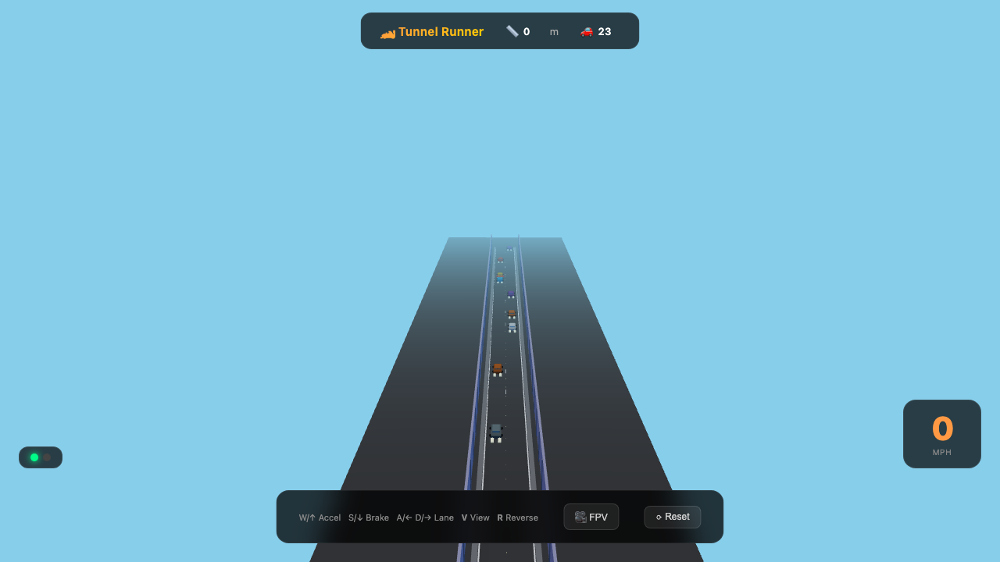

# 🏎️ Tunnel Runner

A 3D tunnel driving game built with **Three.js**. Navigate traffic in a neon-lit highway tunnel — accelerate, brake, switch lanes, and survive as long as you can.



## 🎮 How to Play

| Key | Action |
|---|---|
| **W** / **↑** | Accelerate |
| **S** / **↓** | Brake |
| **A** / **←** | Move left lane |
| **D** / **→** | Move right lane |
| **V** | Toggle view (Top-Down / FPV) |
| **R** | Reverse direction |

- **Score**: Distance traveled in meters — displayed at the top.
- **Speed**: MPH gauge in the bottom-right corner.
- **Crashes**: Colliding with other cars ends the game.

## 🚗 Features

- **4-lane highway** inside a fully enclosed 3D tunnel
- **AI traffic** — other cars speed up, slow down, and create traffic shockwaves
- **Realistic braking** — brake lights glow when cars decelerate
- **Two camera modes**: Top-down orbital view & third-person FPV chase cam
- **Speed-based scoring** — drive faster and farther for a higher score
- **Responsive UI** — works on desktop and mobile browsers

## 🛠️ Tech Stack

- [Three.js](https://threejs.org/) — 3D rendering
- OrbitControls — camera manipulation
- Vanilla JavaScript (ES Modules) — game logic & AI
- No build tools required — runs directly in the browser

## 🚀 Getting Started

Simply open `index.html` in any modern browser. No server or build step required.

```bash
open index.html
```

Or serve locally:

```bash
python3 -m http.server 8080
# then open http://localhost:8080
```

## 📄 License

MIT
